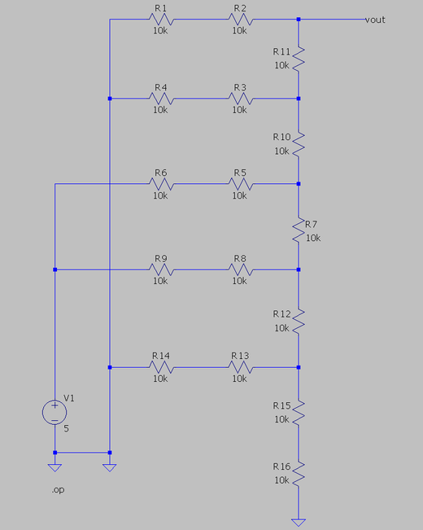
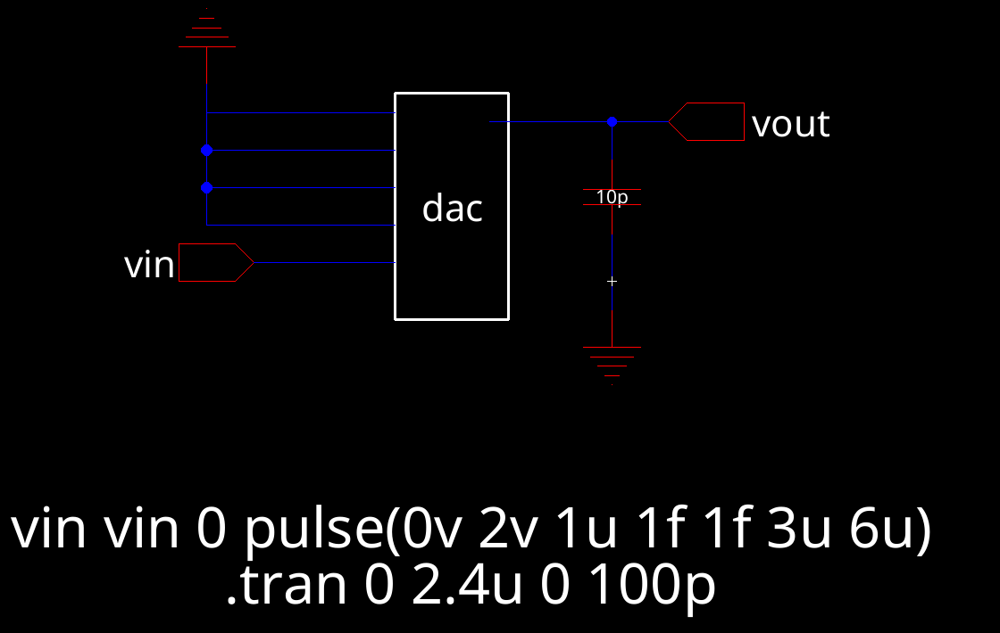
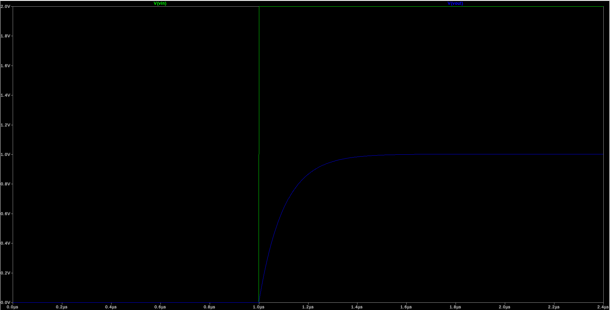
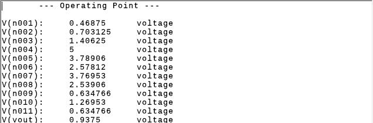
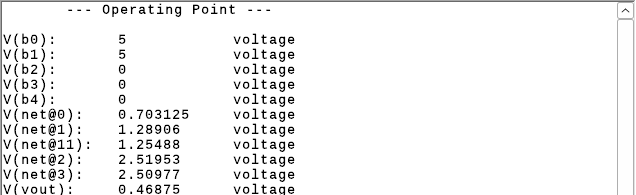
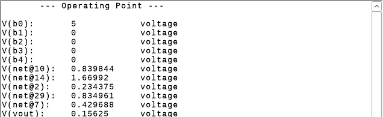
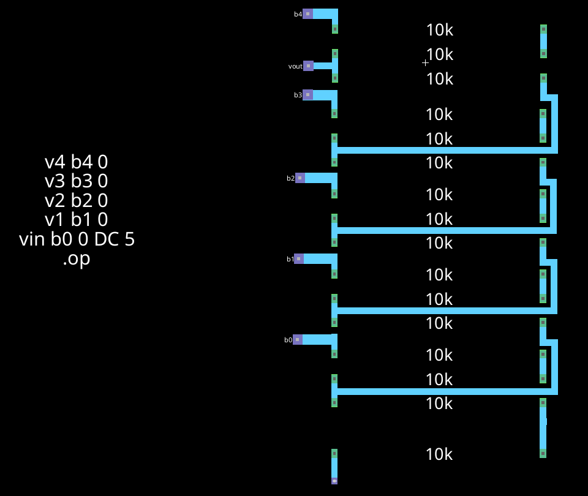
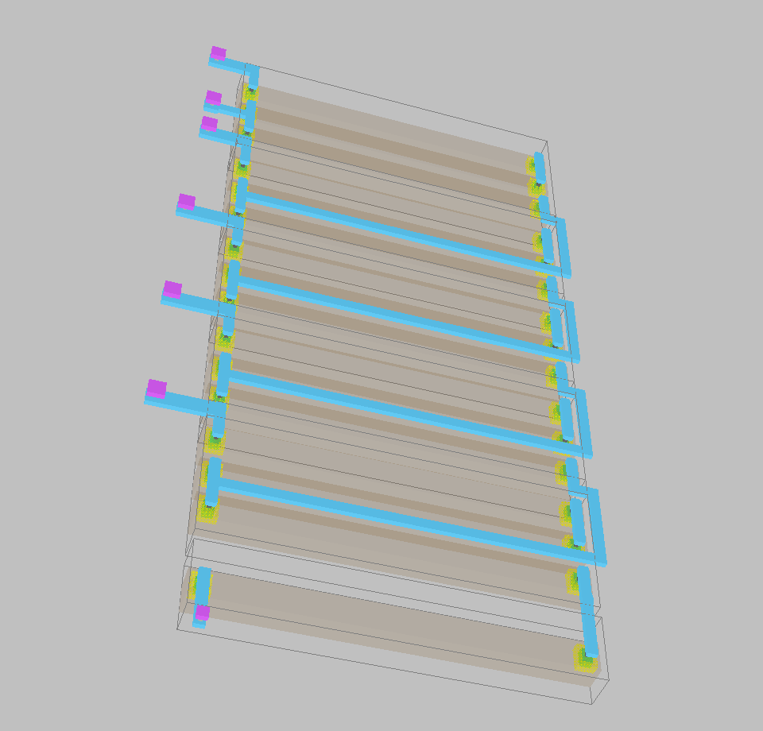

# Lab 1: 5-Bit R-2R Ladder DAC

**ENCE 3501 VLSI | University of Denver | Fall Quarter 2026 | Charlie Shields**

5-bit voltage-mode R-2R ladder DAC (no op-amp) built from 10k n-well resistors. Designed in Electric VLSI (`mocmos`, MOSIS) and simulated in LTspice.

**Jump to:** [Schematic](#schematic) | [Layout](#layout) | [Notes](#notes) | [Files](#files)

---

## Schematic

### DAC design

- VDD = 5 V, N = 5 bits
- 1 LSB = VDD / 2^N = 156.25 mV, full scale (11111) = 4.84375 V
- R = 10k n-well, 2R = two 10k in series
- 16 resistors in total

**Bit slice.** `r_divider{sch}` is one slice: a 2R leg from `in` to `out` (two 10k in series) and one R from `out` to `bot`.

**Ladder.** `dac{sch}` chains five slices, b4 at the top, plus one more 10k to ground. That 10k and the last slice's R make the 2R termination.

**LTspice drawing.** b4, b3 and b0 are grounded and b2, b1 are on the 5 V source, so as drawn the input is 00110. 

*`ltspice/dac_ltspice_circuit.asc`*

### Output resistance

Find the Thevenin Resistance: 

1. The termination is **2R**.
2. At the b0 node the bit's 2R leg is in parallel with the 2R below it: **2R || 2R = R**.
3. Add the R up to the next node: **R + R = 2R**.
4. Every node repeats steps 2 and 3.
5. At `vout` the b4 leg (2R) is in parallel with the 2R below it, which gives R.

**R_out = R = 10k for every input code.** The DAC is `Vth = 5 * code / 32`.

### Delay driving 10 pF

Setup (`spice/daq_sim_2.spi`):

- b3 to b0 grounded
- b4 is a pulse, 0 to 2 V
- 10 pF from `vout` to ground

*Electric `daq_sim{sch}`*

*LTspice, V(vin) and V(vout)*

Delay Calculation:

- With only b4 driven the DAC is a 1 V source (2 V / 2) behind R_out = 10k
- tau = R_out * C = 10k * 10p = 100 ns
- 50 % delay = 0.7RC = **70 ns**

70 ns / ln 2 = 100.9 ns, so the measured R_out is 10.09k.

### Before and after layout

- **Before:** the LTspice circuit
- **After:** the netlist Electric extracts from `dac{lay}` (`spice/dac_layout.spi`)
- `scripts/sweep_codes.py` runs all 32 input codes through both, results in `data/dac_transfer.csv`

| Input | Ideal 5 * code / 32 | Before | After |
|---|---|---|---|
| 00000 | 0 V | 0 V | 0 V |
| 00001 | 0.15625 V | 0.15625 V | 0.15625 V |
| 00011 | 0.46875 V | 0.46875 V | 0.46875 V |
| 00110 | 0.9375 V | 0.9375 V | 0.9375 V |
| 10000 | 2.5 V | 2.5 V | 2.5 V |
| 11111 | 4.84375 V | 4.84375 V | 4.84375 V |

- All 32 codes match the ideal value in both

### LTspice decks:

**LTspice circuit, input 00110: V(vout) = 0.9375 V**

**Electric `dac{sch}` deck, input 00011: V(vout) = 0.46875 V**

**Extracted `dac{lay}` deck, input 00001: V(vout) = 0.15625 V**

### Driving a 10k load

The load and R_out form a divider: `Vout = Vunloaded * RL / (RL + R_out)`. With RL = 10k = R_out the output halves. Simulated with `RL vout 0 10k` on the LTspice circuit:

| Input | Unloaded | 10k load |
|---|---|---|
| 00001 | 0.15625 V | 0.078125 V |
| 00110 | 0.9375 V | 0.46875 V |
| 10000 | 2.5 V | 1.25 V |
| 11111 | 4.84375 V | 2.421875 V |

- LSB drops to 78 mV, full scale to 2.42 V
- The ladder only works into a load much bigger than 10k

---

## Layout

### n-well resistor

- `r_10k{lay}` is one n-well resistor with metal-1 contacts on both ends

Picking width and length, from `R = R_sheet * L / W`:

1. Width first, it has to meet the n-well and contact rules
2. Length comes from the sheet resistance so the strip is 10k at that width

### Resistor cells and the DAC

- `r_divider{lay}`: three 10k resistors at joined with metal 1. `in`, `out` and `bot` are exported on metal-1 pins.
- `dac{lay}`: five `r_divider{lay}` and one `r_10k{lay}`. Exports are `b0` to `b4`, `vout` and `gnd`.

*Electric layout of `dac{lay}`*

*Electric 3D view of `dac{lay}`*

---

## Files

| Path | Purpose |
|---|---|
| `electric/lab1.jelib` | Electric library, all cells (`r_10k`, `r_divider`, `dac`, `daq_sim`, ...) |
| `ltspice/dac_ltspice_circuit.asc` | The DAC drawn in LTspice |
| `spice/` | SPICE decks exported from Electric, and the LTspice logs |
| `images/` | Screenshots and plots used above |
| `docs/` | Lab handout and walkthrough slides |