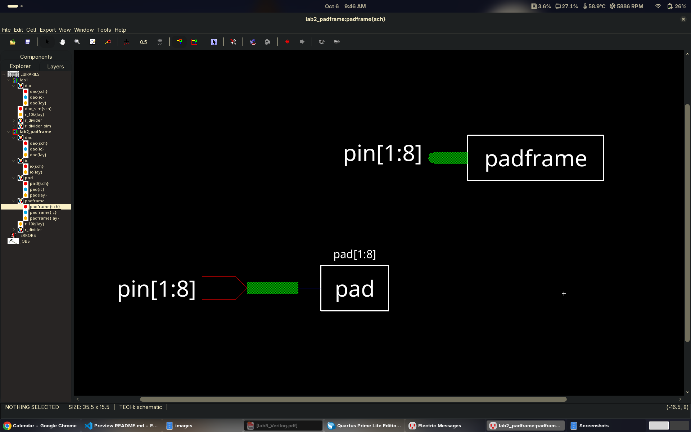
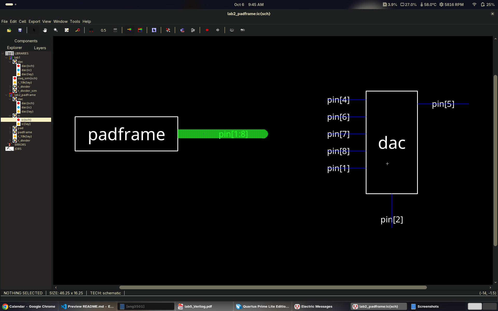
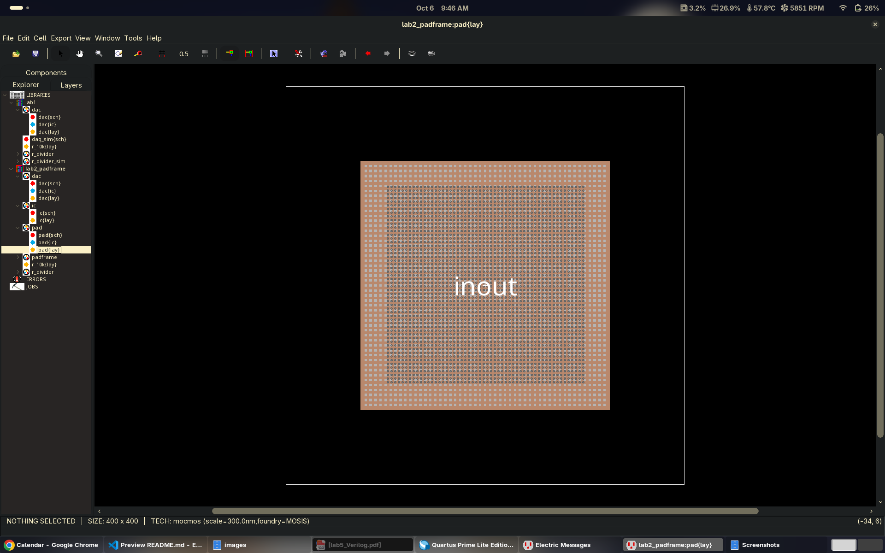
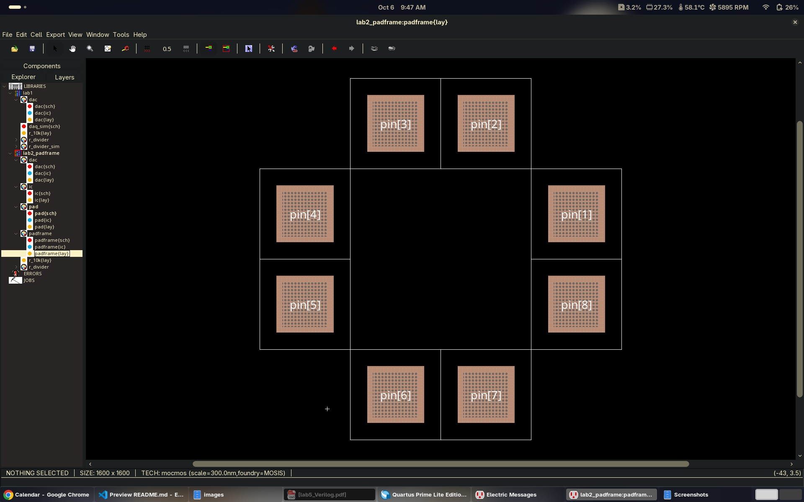
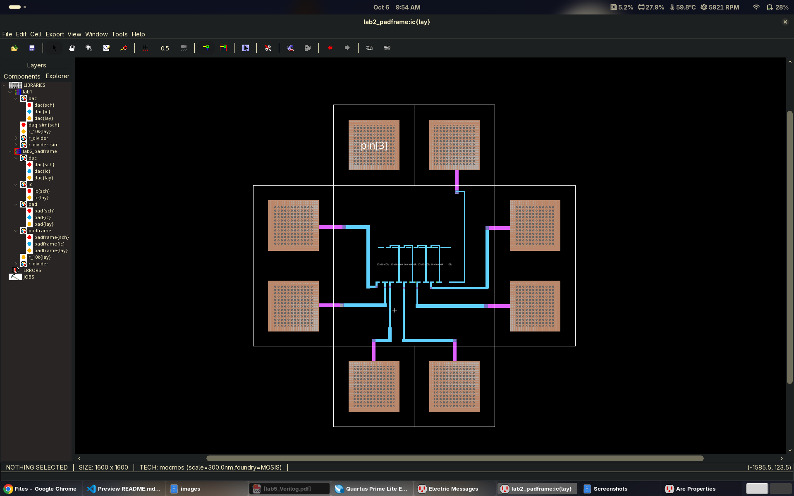

# Lab 2: Padframe for the R-2R DAC

**ENCE 3501 VLSI | University of Denver | Fall Quarter 2026 | Charlie Shields**

Die that connects the 5-bit R-2R DAC from Lab 1 to the outside world through a square padframe. Designed in Electric VLSI (`mocmos`, MOSIS).

**Jump to:** [Schematic](#schematic) | [Layout](#layout) | [Notes](#notes) | [Files](#files)

---

## Schematic

### Pad cell

`pad{sch}`: one `pad` symbol with a single bidirectional `inout` port. Same cell is used for every pin so inputs (`b0` to `b4`) and the output (`vout`) share one design.

*Electric `pad{sch}`*

### DAC

`dac{sch}` is the 5-bit R-2R ladder from Lab 1. See the [Lab 1 README](../lab1/README.md) for the design and simulation.

- Pins: `b0` to `b4`, `vout`, `gnd` (7 total)

### Padframe with the DAC

`padframe{sch}` is a bus of pads `pad[1:8]` tied to the bus `pin[1:8]`. `ic{sch}` puts the `padframe` next to the `dac` and connects each DAC pin to one pad.

Pad count:

1. DAC pinouts: 7 (`b0` to `b4`, `vout`, `gnd`)
2. Square frame means the same number of pads on every side
3. Minimum pads = 8, so 2 per side (7 does not divide into 4 equal sides)
4. Spare pad: `pin[3]`, left unconnected

| Side | Pad | DAC pin |
|---|---|---|
| Top | `pin[3]` | spare |
| Top | `pin[2]` | `gnd` |
| Right | `pin[1]` | `b4` |
| Right | `pin[8]` | `b3` |
| Bottom | `pin[7]` | `b2` |
| Bottom | `pin[6]` | `b1` |
| Left | `pin[5]` | `vout` |
| Left | `pin[4]` | `b0` |

*Pad-to-pin mapping read from `ic{sch}`. Side placement read from `padframe{lay}`. Double check `b0` to `b4` order against the DAC symbol.*

*Electric `padframe{sch}`*

*Electric `ic{sch}`: padframe and DAC with pin connections*

---

## Layout

### Pad cell

`pad{lay}`: 400 x 400 cell with a square bonding pad centered in it, ringed by a vias grid. The cell outline leaves a margin around the pad so neighbours do not touch.

- TODO: confirm metal layers and overglass opening

*Electric `pad{lay}`*

### Padframe

`padframe{lay}`: 8 pad cells in a square ring, 2 pads per side, 1600 x 1600 total. Empty center holds the DAC.

*Electric layout of `padframe{lay}`*

### Padframe with the DAC inside

`ic{lay}`: DAC placed in the center of the frame, each used pad wired to its DAC pin.

- Pad placement: same ring as `padframe{lay}`, `pin[3]` labeled only, no wire
- DAC placement: centered
- Routing: metal-2 (magenta) stub from each pad, metal-1 (blue) to the DAC pins
- DRC: TODO
- NCC / LVS: TODO

*Electric layout of `ic{lay}`*

---

## Notes

- Screenshots are from Electric, `images/` has no `dac_sch` or 3D view yet.

---

## Files

| Path | Purpose |
|---|---|
| `lab2.jelib` | Electric library, Lab 2 cells |
| `lab2_padframe.jelib` | Electric library: `pad`, `padframe`, `ic`, `dac` cells |
| `lab1.jelib` | Lab 1 library, DAC cells |
| `images/` | Screenshots used above |
| `ENCE_3501_Lab_2.pdf` | Lab handout |
