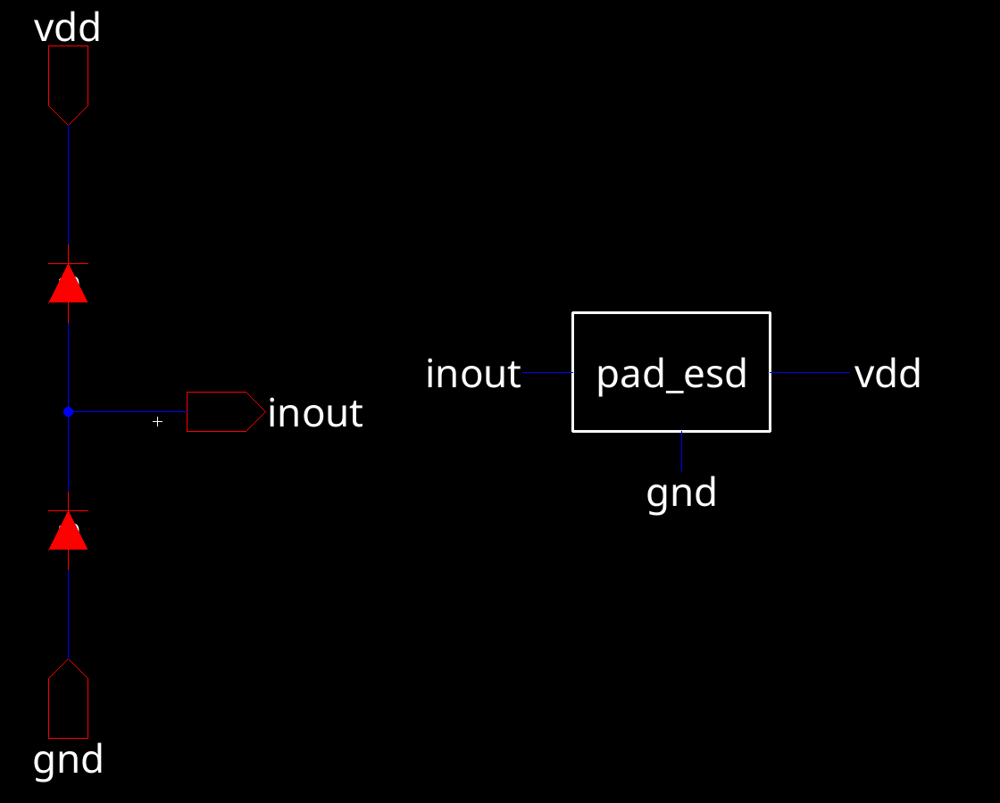
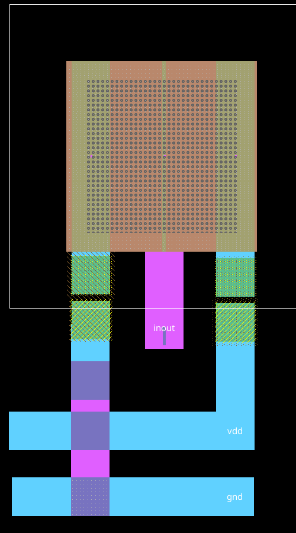
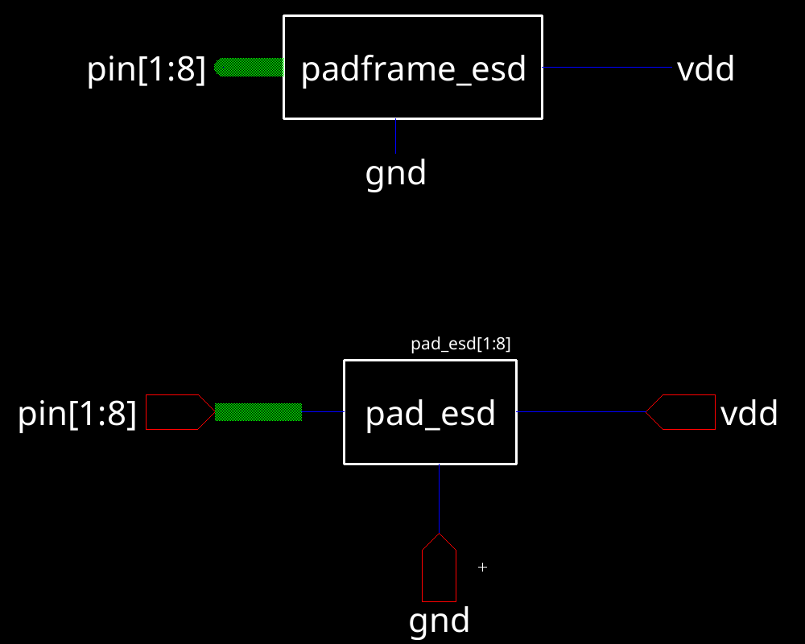
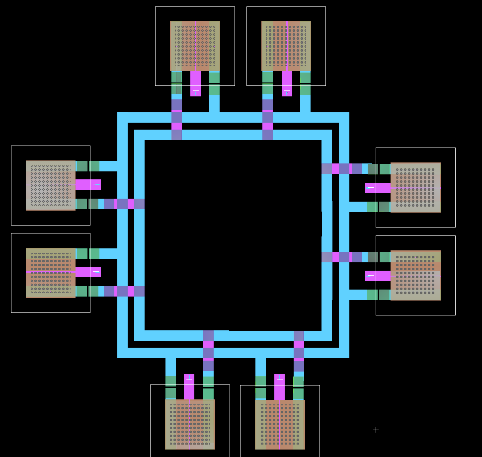

# Lab 3: ESD-Protected Padframe

**ENCE 3501 VLSI | University of Denver | Fall Quarter 2026 | Charlie Shields**

Adds double-diode ESD clamps to every pad of the Lab 2 padframe, then drops the Lab 1 DAC inside. Each pad gets one diode from `inout` up to `vdd` and one from `gnd` up to `inout`, so an ESD strike at any pin is shunted to a supply rail instead of into the DAC. Designed in Electric VLSI (`mocmos`, MOSIS); NMOS I-V bench simulated in LTspice against the C5 models.

**Jump to:** [NMOS I-V](#nmos-iv) | [ESD diodes](#esd-diodes) | [Pad with ESD](#pad-with-esd) | [Padframe](#padframe-with-esd) | [Final IC](#final-ic) | [Notes](#notes) | [Files](#files)

---

## NMOS I-V

`NMOS_IV{sch}` and `{lay}` are a standalone bench for the C5 NMOS: a single device with source and bulk at ground, Vgs stepped 0 to 5 V, Vds swept 0 to 5 V. The SPICE card on the layout is:

```
.dc vd 0 5 1m vg 0 5 1
.include C5_models.txt
```

Purpose: confirm the model file is wired up and sanity-check the device before using it anywhere else in the lab.

<!-- TODO: add NMOS_IV schematic, layout, and I-V curve screenshots -->

---

## ESD diodes

Two diode cells, one for each rail of the clamp. Both are drawn as the active region sitting in a well of the opposite type, so the junction is the ESD diode and the well tap sets the anode or cathode to the rail.

### `nActive_pWell` — gnd-side clamp

n+ active in p-well. Cathode is the n+ (tied to the pad `inout`), anode is the p-well (tied to `gnd`). Reverse-biased in normal operation; forward-conducts a negative ESD spike on `inout` straight to `gnd`.

<!-- TODO: add nActive_pWell schematic + layout screenshots -->

### `pActive_nWell` — vdd-side clamp

p+ active in n-well. Anode is the p+ (tied to `inout`), cathode is the n-well (tied to `vdd`). Reverse-biased in normal operation; forward-conducts a positive ESD spike on `inout` straight to `vdd`.

<!-- TODO: add pActive_nWell schematic + layout screenshots -->

---

## Pad with ESD

### Schematic

`pad_esd{sch}` is the Lab 2 `pad` symbol plus the two diodes in series between `vdd` and `gnd`, with `inout` tapped off the midpoint. Three ports now instead of one: `inout`, `vdd`, `gnd`.



*Electric `pad_esd{sch}`. Red triangles are the two diodes (top: `pActive_nWell` to vdd, bottom: `nActive_pWell` to gnd). The pad symbol on the right carries all three nets out of the cell.*

### Layout

`pad_esd{lay}` keeps the Lab 2 bonding pad on top and drops the two diode cells below it, tied to the pad on metal-1 and routed out to `vdd` and `gnd` rails on metal-2 (blue).

- Pad: unchanged from Lab 2
- Diodes: `pActive_nWell` + `nActive_pWell` stacked below the pad
- Routing: metal-1 (blue) stub from pad to the diode anode/cathode nodes; `vdd` and `gnd` leave the cell on metal-2 straps so they can be rung around the padframe



*Electric `pad_esd{lay}`. 400.5 x 673.5 cell: pad on top, two diffusion-in-well diode cells on the bottom half, vdd / gnd rails exiting left and right.*

---

## Padframe with ESD

### Schematic

`padframe_esd{sch}` is the Lab 2 `padframe{sch}` with every `pad` instance swapped for `pad_esd`. The pad bus `pin[1:8]` is unchanged; `vdd` and `gnd` are promoted to padframe-level nets so every clamp shares the same rails.



*Electric `padframe_esd{sch}`. One `pad_esd[1:8]` array wires `pin[1:8]` to the ring and lands `vdd` and `gnd` on the frame.*

### Layout

`padframe_esd{lay}` places 8 `pad_esd` cells in the same square ring as Lab 2, then rings `vdd` (inner) and `gnd` (outer) around all four sides on metal-2 so every pad's clamp has a short, low-R path to the supply.

- Pads: 8, 2 per side, same positions as Lab 2
- vdd ring: metal-2, inside the pad ring
- gnd ring: metal-2, outside the pad ring
- DRC: 1 notch warning on Metal-2 flagged in the layer DRC run; TODO confirm it is a non-critical notch and not a short



*Electric `padframe_esd{lay}`. 8 ESD-protected pads with vdd / gnd rings on metal-2. Center is open for the DAC.*

---

## Final IC

### With ESD (`final_ic_esd`)

Lab 1 DAC dropped into `padframe_esd`, same pad-to-DAC mapping as Lab 2. `vdd` and `gnd` land on the clamp rings; signal pins route through the clamps to the DAC.

- Pad mapping: inherited from Lab 2 (`b0`-`b4`, `vout`, `gnd`, 1 spare); `vdd` is now a dedicated frame rail, not a spare pad
- DRC / NCC / LVS: TODO

<!-- TODO: add final_ic_esd schematic + layout screenshots -->

### Without ESD (`final_ic_no_esd`)

Control cell: the Lab 2 unprotected padframe + DAC, kept side-by-side for the write-up. Lets the ESD overhead (extra area for the diodes and rings) be measured against the unprotected version.

<!-- TODO: add final_ic_no_esd screenshots + area comparison -->

---

## Notes

- Clamp topology is the standard double-diode: both diodes reverse-biased at DC, forward-biased only on an ESD event that pulls `inout` above `vdd` + Vf or below `gnd` - Vf.
- `vdd` and `gnd` rings on metal-2 are what make the clamps useful; a thin trace would just move the problem.
- One Layout DRC notch on Metal-2 in `padframe_esd` is still outstanding (see left panel of layout screenshot).

---

## Files

| Path | Purpose |
|---|---|
| `lab3.jelib` | Electric library, Lab 3 cells |
| `lab_3_nmos_esd_template.jelib` | Starter library from the handout: `NMOS_IV`, `nActive_pWell`, `pActive_nWell`, `pad_esd`, `padframe_esd`, `final_ic_esd`, `final_ic_no_esd` |
| `lab2_padframe.jelib` | Lab 2 library: `pad`, `padframe`, `ic`, `dac` cells (reused) |
| `lab1.jelib` | Lab 1 library, DAC cells |
| `C5_models.txt` | C5 SPICE models used by `NMOS_IV` |
| `images/` | Screenshots used above |
